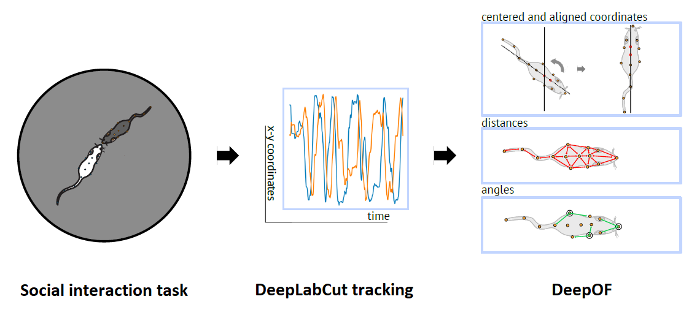
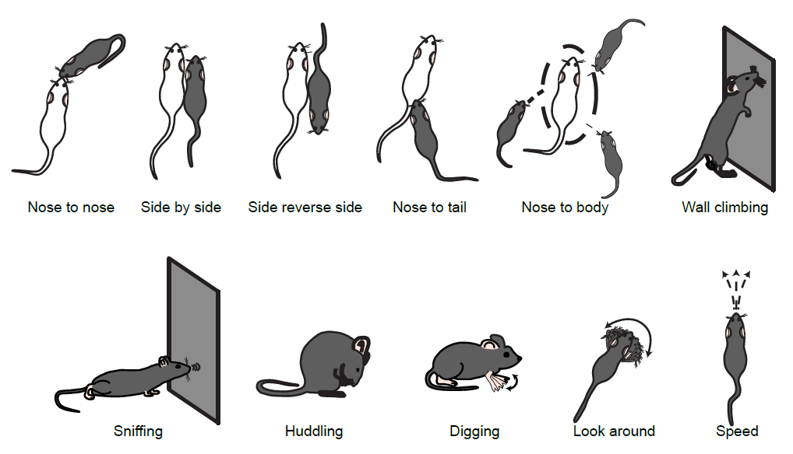
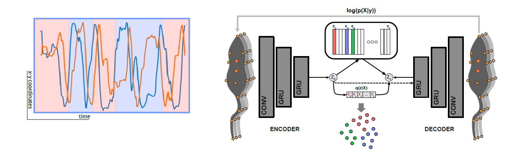

My research investigates potential stress-related cellular targets using different molecular techniques, such as RNAscope and multi-omics, combined with in-vivo approaches such as brain microdialysis and miniscopes, to enhance cellular and behavioral resolution. In addition, an important part of my work has been to develop novel behavioral phenotyping tools, especially related to social behavior. We have established this by using a more naturalistic behavioral set-up and using deep learning algorithms (supervised and unsupervised analysis tools) to observe distinct social behavioral differences after chronic social defeat stress.

[Associated publication in Nature Communications](https://www.nature.com/articles/s41467-023-40040-3)

**Deep phenotyping of social behavior using our open-source python package [DeepOF](https://deepof.readthedocs.io/en/latest/?badge=latest)**  
Many different labs are currently exploring the possibilties of [DeepLabCut](https://github.com/DeepLabCut/DeepLabCut) annotated pose-estimation data. Even though, the possibilities of multi-animal tracking are providing an plethora of social and individual behavior to investigate, the interpretation of the DeepLabCut output, "X,Y" coordinates over time, remains complicated. The DeepOF module can calibrate the DeepLabCut data and export directly a set of individualistic- and social behaviors, using a supervised pipeline dependent on machine learning and rule-base annotations.

Set of supervised behavioral classifiers:  

In addition, an unsupervised pipeline was employed using VQVAE autoencoder models. 

**Current research**

Social behaviors and interactions are crucial for healthy living and are notably impaired in different types of anxiety disorders. Anxiety disorders, including social anxiety disorder, have the highest prevalence among psychiatric conditions, with an estimated annual prevalence reaching up to 18%. Preclinical mouse models play a crucial role to assess symptoms of psychiatric conditions. However, assessing anxiety-induced social behavioral alterations in mice has been challenging due to the difficulties in tracking multiple animals.

During my PhD, I used a computational pipeline that utilizes machine learning to analyze freely moving social interactions in an automated manner. This enables a comprehensive understanding of social behavioral profiles and can contribute to enhance the understanding of anxiety-induced social behavioral changes.

A risk factor for the development of anxiety disorders is the exposure to negative life events, especially during early life. Given the impact of stress exposure on psychopathology, the neuroendocrine components of the stress response system are prime candidates for elucidating the molecular mechanisms underlying anxiety disorders. An important component of the stress response system is corticotropin-releasing factor (CRF). The CRF system, mediated by CRFR1 and CRFR2 receptors, plays a crucial role in modulating anxiety and social behavior. Thus, investigating CRF-specific neurocircuitry is essential to understand the neurobiological mechanisms driving stress-induced social behavioral alterations. 

A potentially interesting brain region in this context is the insular cortex (insula), which is crucial for emotional processing, including social stimuli. Additionally, the insula is heavily involved in the response to stress, in which the CRF system has shown sex-specific alterations during anxiety-related and social behaviors. However, the CRF neurobiological pathways within the insula and their effects on social behavior remain unclear.

The goal of this research program is to identify the contribution of CRF neuromodulation in the insula on the effects of early life stress, as a model of pathological anxiety, on social behaviors. The goal is to identify anatomical, functional, and neural coding alterations within the CRF system of the insula and their behavioral impact. The current research program aims to enhance the understanding of stress-induced social behavioral symptoms and underlying neurocircuitry in anxiety disorders, with the ultimate goal of advancing treatment options for these psychiatric conditions.

  

